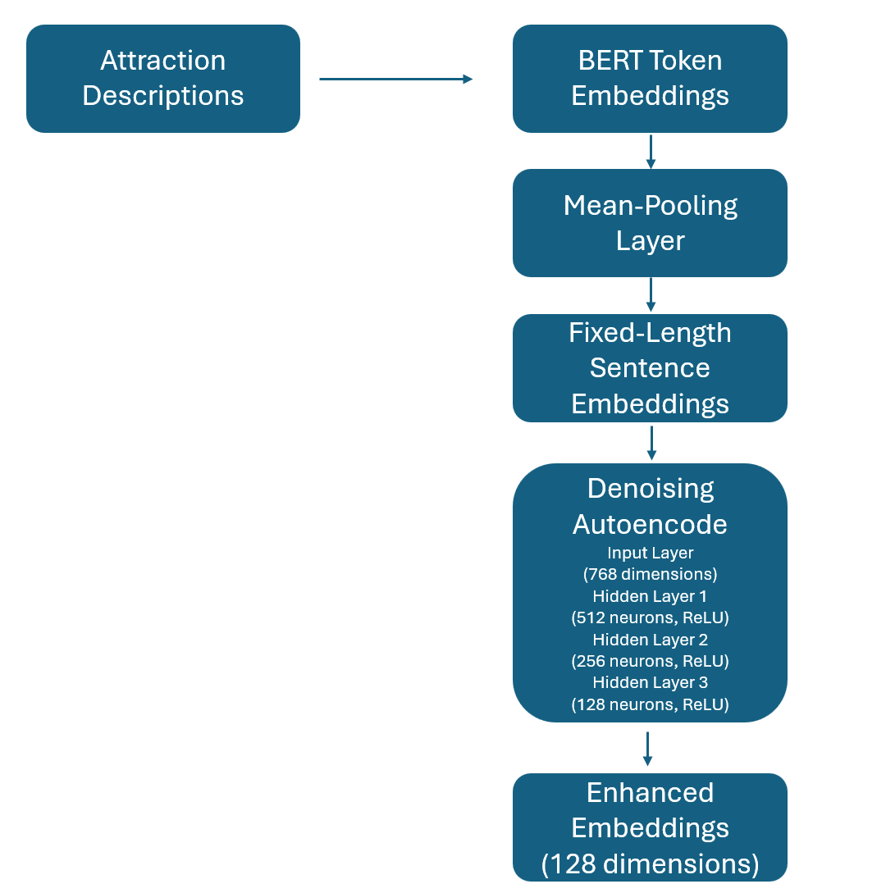

# Vector Search

This dataset was created by combining data from the [World Cities Dataset](https://www.kaggle.com/datasets/viswanathanc/world-cities-datasets) with web scraping techniques to obtain city-specific codes from Tripadvisor, which are not available elsewhere.
It includes city names and the top attractions with descriptions for each one of them.

We generated embeddings for the attraction descriptions using BERT's pre-trained model to obtain token embeddings. We applied mean-pooling over the token embeddings to produce fixed-length sentence embeddings of 768 dimensions. Then, we trained a denoising autoencoder neural network with three hidden layers (512, 256, 128 neurons) to reduce the embedding dimensions and enhance relevance to our dataset. The model used ReLU activation functions and the Adam optimizer with a learning rate of 0.001.

<p align="center"></p>


We trained the denoising autoencoder by corrupting the input embeddings with Gaussian noise. The network learned to reconstruct the original embeddings from the noisy inputs using the Mean Squared Error (MSE) loss function, defined as:

$$
L = \frac{1}{N} \sum_{i=1}^{N} (x_i - x'_i)^2
$$

where $x_i$ is the original embedding and $x'_i$ is the reconstructed embedding. This loss function minimized the difference between the original and reconstructed embeddings. It is appropriate because it encourages the model to learn robust representations that capture the essential features of the data.


## Embeddings

.gif>)


### What can we see?

In our visualization of the embeddings, we observe that the pre-trained embeddings form slightly better-defined clusters compared to the tuned embeddings. Clusters are evident in both visualizations, and they appear to be grouped by country or the language spoken in the cities. For example, in the plots (or GIF), we can see distinct clusters where the cities are from Brazil and others where the cities are from Germany. These clusters are present in both the pre-trained and tuned embeddings visualizations.

However, in the second image showing the tuned embeddings, the clusters appear to be less tightly grouped. This suggests that the tuning process may have dispersed the clusters somewhat, leading to less pronounced groupings.

## Using it

- If you are connected to [Insper](https://www.insper.edu.br/en/home)'s WiFi network, use these links below:
### Example Requests

1. **Test that yields 10 results**:
    
    [http://10.103.0.28:9876/query?query=Oktoberfest](http://10.103.0.28:9876/query?query=Oktoberfest)
   
   - Searching for "Oktoberfest" returns up to 10 cities in Germany.

2. **Test that yields less than 10 results**:
    
    [http://10.103.0.28:9876/query?query=Gardens](http://10.103.0.28:9876/query?query=Gardens)
    
   - Searching for "Gardens" returns fewer than 10 results.

3. **Test that yields something non-obvious**:
    
    [http://10.103.0.28:9876/query?query=Football](http://10.103.0.28:9876/query?query=Football)

    - Searching for "Football" returns a city in Ukraine.

## MLOPs Specialist:

The system is deployed to our server and it gives a response in less than one second.


Also, there is a new endpoint to update the files used by the model.
The endpoint is `/update_model`. It is a GET request that accepts `encoder_url` and `embeddings_url` as query parameters. This will allow you to test the update functionality directly from a browser by entering the URLs in the address bar.
I used the same files, but on Google Drive, so we could test it like this:

```
http://10.103.0.28:9876/update_model?encoder_url=https://drive.usercontent.google.com/u/0/uc?id=1xW-cZD0ON7Ad8BowI_GGwZ0T1uiEbXXj&export=download&embeddings_url=https://drive.usercontent.google.com/u/0/uc?id=1lB4izQ5oy09Od6Jdr7keoJ4Z8fZeiWqr&export=download
```
```py
@app.get("/update_model")
def update_model(
    encoder_url: str = Query(..., description="URL to download encoder.pth"),
    embeddings_url: str = Query(..., description="URL to download tuned_embeddings.npy")
):
    encoder_path = '../data/encoder.pth'
    embeddings_path = '../data/tuned_embeddings.npy'
    
    try:
        encoder_response = requests.get(encoder_url, timeout=10)
        encoder_response.raise_for_status()
        with open(encoder_path, 'wb') as f:
            f.write(encoder_response.content)
    except Exception as e:
        raise HTTPException(status_code=400, detail=f"Failed to download encoder: {e}")
    
    try:
        embeddings_response = requests.get(embeddings_url, timeout=10)
        embeddings_response.raise_for_status()
        with open(embeddings_path, 'wb') as f:
            f.write(embeddings_response.content)
    except Exception as e:
        raise HTTPException(status_code=400, detail=f"Failed to download embeddings: {e}")
    
    try:
        load_encoder()
        load_embeddings()
    except Exception as e:
        raise HTTPException(status_code=500, detail=f"Failed to reload model and embeddings: {e}")
    
    return {"message": "Model and embeddings updated successfully"}

```
